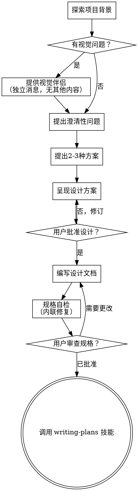

# 头脑风暴：将想法转化为设计

通过自然的协作对话，将想法转化为完整的设计和规格文档。

首先了解当前项目背景，然后逐一提问来完善想法。在理解你要构建什么之后，呈现设计方案并获得用户批准。

<硬性门槛>
在呈现设计方案并获得用户批准之前，不要调用任何实现技能、编写任何代码、搭建任何项目或采取任何实现行动。这适用于所有项目，无论其看似多么简单。
</硬性门槛>

## 反模式："这太简单了，不需要设计"

每个项目都要经过这个过程。待办事项列表、单功能工具、配置更改——全都是。"简单"的项目往往是不加审视的假设造成最大浪费的地方。设计可以很短（真正简单的项目只需几句话），但你必须呈现它并获得批准。

## 检查清单

你必须为每个项目创建任务并按顺序完成：

1. **探索项目背景** — 检查文件、文档、最近的提交
2. **提供视觉伴侣**（如果主题涉及视觉问题）— 这是独立的消息，不要与澄清问题合并。参见下面的视觉伴侣部分。
3. **提出澄清性问题** — 一次一个，理解目的/约束/成功标准
4. **提出2-3种方案** — 包含权衡和你推荐的建议
5. **呈现设计方案** — 按复杂度缩放各部分，在每个部分后获取用户批准
6. **编写设计文档** — 保存到 `docs/design-docs/YYYY-MM-DD-<主题>-design.md` 并提交
7. **规格自检** — 快速检查占位符、矛盾、歧义、范围（见下文）
8. **用户审查书面规格** — 在继续之前请用户审查规格文件
9. **过渡到实现** — 调用 writing-plans 技能创建实施计划

## 流程图

**最终状态是调用 writing-plans。** 不要调用 frontend-design、mcp-builder 或任何其他实现技能。头脑风暴后唯一调用的技能是 writing-plans。

## 流程详解

**理解想法：**

- 首先了解当前项目状态（文件、文档、最近的提交）
- 在提出详细问题之前，评估范围：如果请求描述了多个独立子系统（例如"构建一个包含聊天、文件存储、计费和分析的平台"），立即标记这一点。不要在需要先分解的项目上花费时间完善细节。
- 如果项目太大无法容纳在单个规格中，帮助用户分解为子项目：哪些是独立的部分，它们如何关联，应该按什么顺序构建？然后通过正常的设计流程头脑风暴第一个子项目。每个子项目都有自己的规格→计划→实施周期。
- 对于规模适当的项目，一次提一个问题来完善想法
- 尽可能使用多选问题，但开放性问题也可以
- 每条消息只问一个问题——如果某个主题需要更多探索，将其分解为多个问题
- 专注于理解：目的、约束、成功标准

**探索方案：**

- 提出2-3种不同的方案及其权衡
- 以对话方式呈现选项，包含你的建议和理由
- 首先提出你推荐的选项并解释原因

**呈现设计：**

- 一旦你相信自己理解了要构建什么，就呈现设计
- 根据每部分的复杂度调整篇幅：直接明了的用几句话，复杂细微的可达200-300字
- 每个部分后询问是否看起来正确
- 涵盖：架构、组件、数据流、错误处理、测试
- 如果有什么不合理的地方，准备好回头澄清

**隔离和清晰设计：**

- 将系统拆分为更小的单元，每个单元有一个清晰的目的，通过明确定义的接口通信，可以独立理解和测试
- 对于每个单元，你应该能够回答：它做什么，你怎么使用它，它依赖什么？
- 有人能够在不阅读内部实现的情况下理解一个单元做什么吗？你能够在不破坏使用者的情况下更改内部实现吗？如果不能，边界需要改进。
- 更小、边界更清晰的单元也更容易与你合作——你能够更好地理解可以一口气掌握的代码，当文件专注于做一件事时，你的编辑也更可靠。当一个文件变得很大时，这通常是它做得太多的信号。

**在现有代码库中工作：**

- 在提出变更之前先探索当前结构。遵循现有模式。
- 如果现有代码有问题影响工作（例如，一个变得太大的文件、不清晰的边界、混乱的职责），将针对性的改进作为设计的一部分——就像一个优秀的开发者在工作时改进代码一样。
- 不要提出无关的重构。专注于为当前目标服务的内容。

## 设计之后

**文档：**

- 将已验证的设计（规格）写入 `docs/design-docs/YYYY-MM-DD-<主题>-design.md`
  - （用户对规格位置的偏好优先于此默认位置）
- 如果有 elements-of-style:writing-clearly-and-concisely 技能可用，使用它
- 将设计文档提交到 git

**规格自检：**
写完规格文档后，用新的眼光审视：

1. **占位符扫描：** 是否有"TBD"、"TODO"、不完整的部分或模糊的需求？修复它们。
2. **内部一致性：** 是否有部分相互矛盾？架构是否与功能描述匹配？
3. **范围检查：** 是否足够专注于单个实施计划，还是需要分解？
4. **歧义检查：** 是否有任何需求可以被两种方式解释？如果是，选择一种并明确说明。

内联修复任何问题。不需要重新审查——直接修复并继续。

**用户审查门槛：**
规格审查循环通过后，在继续之前请用户审查书面规格：

> "规格已编写并提交到 `<路径>`。请审查它，告诉我是否想在开始编写实施计划之前做任何更改。"

等待用户的回复。如果他们请求更改，进行修改并重新运行规格审查循环。只有在用户批准后才能继续。

**实施：**

- 调用 writing-plans 技能创建详细的实施计划
- 不要调用任何其他技能。writing-plans 是下一步。

## 关键原则

- **一次一个问题** — 不要用多个问题让用户不知所措
- **多选优先** — 比开放性问题更容易回答时使用
- **严格执行 YAGNI** — 从所有设计中删除不必要的功能
- **探索替代方案** — 在确定之前始终提出2-3种方案
- **增量验证** — 呈现设计，获得批准后再继续
- **保持灵活** — 当某些内容不合理时回头澄清

## 视觉伴侣

一个基于浏览器的伴侣，用于在头脑风暴期间显示线框图、图表和视觉选项。作为工具提供，不是模式。接受伴侣意味着它可以用于受益于视觉处理的问题；这并不意味着每个问题都要通过浏览器。

**提供伴侣：** 当你预计即将提出的问题涉及视觉内容（线框图、布局、图表）时，提供一次以获取同意：
> "我们正在做的一些内容，如果我能在网页上展示给你看，可能更容易解释。我可以随进度整理线框图、图表、比较和其他视觉内容。这个功能还很新，可能会消耗较多令牌。想试试吗？（需要打开一个本地 URL）"

**这个提供必须是独立的消息。** 不要与澄清问题、背景摘要或任何其他内容合并。消息应该只包含上述内容，不要有其他内容。等待用户回复后再继续。如果他们拒绝，继续纯文本头脑风暴。

**每个问题决策：** 即使用户接受了，也要为每个问题决定是否使用浏览器还是终端。判断标准：**用户通过看到它比阅读它能更好地理解吗？**

- **使用浏览器** 处理本身就是视觉的内容——线框图、布局、布局比较、架构图表、并行视觉设计
- **使用终端** 处理文本内容——需求问题、概念选择、权衡列表、A/B/C/D 文本选项、范围决策

关于 UI 主题的问题不一定自动是视觉问题。"这个背景下个性意味着什么？"是概念问题——使用终端。"哪个向导布局效果更好？"是视觉问题——使用浏览器。

如果他们同意伴侣，在继续之前阅读详细指南：
`skills/brainstorming/visual-companion.md`
