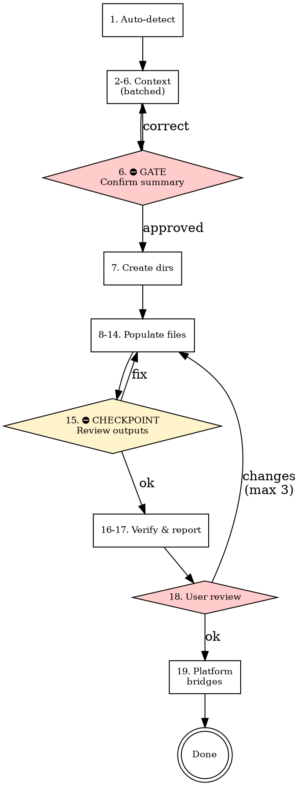

# Harness Setup

## 什么是 Scaffold？

**Scaffold（脚手架）** 是为项目创建一套初始的 agent 文档结构。就像建筑施工中的脚手架一样——它是一个临时框架，用来支撑主要结构。

在 `harness-setup` 的语境中，**scaffold** 指的是：
- 生成 `AGENTS.md` — agent 的操作入口和索引
- 生成 `ARCHITECTURE.md` — 项目技术架构图
- 创建 `docs/` 目录树及模板文件
- 确立文档规范，让 AI coding agents 从第一天起就能理解和参与项目

Scaffold 不是写具体功能文档，而是搭建**文档框架**和**约定**，使 agent 能高效地在项目中导航、理解和工作。

## Scaffold vs update

**Scaffold（默认）** — 用户想要一个新的 harness 或首次设置。按照下面的 **阶段 1–5** 执行。在阶段 1 第 6 步（汇总）确认之前，不要创建任何文件。

**Harness update** — 当用户说 `harness update`、`update harness`、`add domain to harness`、`refresh docs`、`sync harness`，或者仓库已有 `AGENTS.md` 和 `docs/`，且用户明确想要增量修改时触发。按照 **Harness update 模式** 执行（在阶段 1–5 之后）。如果 harness 文件缺失，提示用户先运行 scaffold。

**现有 harness 意图不明确：** 如果 `AGENTS.md` + `docs/` 已存在，但用户说 scaffold、create harness、set up harness（没有明确说 update），要询问："我发现已有 harness。你想要 **re-scaffold**（覆盖）还是 **update**（增量修改）？" 不要假设其中一种。

### 硬性门槛（scaffold）

仅对 **scaffold**：在阶段 1 完成且用户确认汇总表（第 6 步）之前，**不要创建任何文件或目录**。无论项目看似简单与否，这对所有项目都适用。

## Checklist（scaffold）

你必须为每个项目创建一个 task，并按顺序完成：

### Phase 1 — 收集上下文（可批量时批量处理）

1. **自动检测** — 扫描仓库：目标路径、baseline（greenfield vs existing）、技术栈
2. **Identity + 检测表** — 显示检测结果；询问项目名称和一句话目的（自由格式）
3. **Shape + architecture** — 一次交互：项目类型 + 架构风格（结构化选项）
4. **Domains** — 主要产品领域，用于 `docs/product-specs/*.md`（自由格式）
5. **Agent platforms** — 一次交互：团队使用的 agent 工具（多选：Cursor、Claude Code、Codex、Windsurf、GitHub Copilot、Cline、Other）
6. **确认汇总** — 紧凑表格，用户批准 ⛔ 门槛：批准前不创建文件

### Phase 2 — 创建目录结构

7. **创建核心目录** — `docs/`、子目录包括 `design-docs/`、`exec-plans/active/`、`exec-plans/completed/`、`generated/`、`product-specs/`、`references/`

### Phase 3 — 填充文件

8. **填充根目录** — `AGENTS.md`、`ARCHITECTURE.md`（每个文件按 file-specs 包含 **How to use this harness**）
9. **填充顶层 docs** — DESIGN、PLANS、PRODUCT_SENSE、QUALITY_SCORE、RELIABILITY、SECURITY、FRONTEND（如适用）
10. **填充 design docs** — `design-docs/index.md`、`core-beliefs.md`
11. **填充 exec plans** — tech-debt-tracker、`active/`、`completed/`
12. **填充 generated** — schema 占位符
13. **填充 product specs** — index + per-domain 文件
14. **填充 references** — LLM context stubs
15. **⛔ 检查点** — 列出阶段 3 创建/更新的所有文件；用户可在阶段 4 前请求修复

### Phase 4 — 验证 & 审查

16. **验证交叉链接** — 路径和 Markdown 链接可解析
17. **最终报告** — 汇总表、下一步、如果选择了 Claude Code / Codex 则提供原生 AGENTS.md 支持
18. **用户审查** — 需要时修改（最多 3 轮）

### Phase 5 — 生成后（无需额外提问）

19. **Agent platform bridges** — 根据 [references/file-specs.md](references/file-specs.md) "Agent platform bridge files" 为阶段 5 中选择的每个平台生成文件

## Process flow（scaffold）

## 何时加载 references

- **Principles and constraints：** 生成内容前阅读 [references/harness-principles.md](references/harness-principles.md)。
- **Per-file content：** 填充每个路径时遵循 [references/file-specs.md](references/file-specs.md)。

## Phase 1 — 收集上下文

**交互规则：**

- **批量相关选择** — 合并 shape + architecture。保持 **identity** 和 **domains** 为独立步骤（自由格式）。
- **不要过度拆分：** 如果两个问题都是结构化选择且密切相关，一起呈现。
- 尽可能使用结构化多选；适当包含 **Other (I'll describe)**。
- 提问前**先扫描**仓库：推断技术栈、路径、baseline — 在第 2 步的**检测表**中展示。

**Step 1（自动）** — 扫描：仓库根信号（`.git/`、`package.json` 等）、现有 `AGENTS.md` / `docs/`、技术栈文件（`package.json`、`go.mod`、`pyproject.toml` …）。

**Step 2** — 呈现：目标路径、baseline 摘要、技术栈摘要。询问：项目名称 + 一句话目的。

**Step 3** — 一次呈现 Shape + architecture：

- Shape：Frontend / Backend / Fullstack / CLI / Library / Other
- Architecture：Layered / Hexagonal / Microservices / Monolith / Other

**Step 4** — Domains（自由格式）：列出主要产品领域；每个领域生成 `docs/product-specs/<domain>.md`。

**Step 5** — Agent platforms（多选）：**Cursor**、**Claude Code**、**Codex**、**Windsurf**、**GitHub Copilot**、**Cline**、**Other**

**Step 6 — 汇总表 + GATE**

| Topic | Capture |
| ----- | ------- |
| Identity | 名称、一句话目的 |
| Target path | 仓库根目录 |
| Baseline | Greenfield vs existing |
| Stack | 语言、框架、工具 |
| Shape | Frontend / backend / fullstack / CLI / library / other |
| Domains | 列表 |
| Architecture | 风格 |
| Agent platforms | 哪些工具（用于阶段 5 bridges） |

用户批准 → Phase 2。

## Phase 2 — 创建目录结构

只创建缺失的目录（不删除用户文件）。树结构：`docs/design-docs/`、`exec-plans/active|`completed/`、`generated/`、`product-specs/`、`references/`。

**无目录树检查点** — 继续阶段 3。

## Phase 3 — 填充文件

目录存在后，按照 [references/file-specs.md](references/file-specs.md) 的顺序填充。`AGENTS.md` **必须**包含 **How to use this harness**（3 行使用表 + 链接到 `docs/PLANS.md`）。`AGENTS.md` 必须保持在 **120 行硬性上限**以内。

**AGENTS.md 生成约束：** 使用 [templates/AGENTS-index.md](templates/AGENTS-index.md) 模板生成 `AGENTS.md`。内容应只包括：
- 一句话项目描述
- `docs/` 导航目录（带超链接）
- 常用命令快速参考（构建 / 测试 / lint / 运行）
- 已安装 Skills 快速参考（带使用场景）
- **行为规则**（从 [references/behavior-rules.md](references/behavior-rules.md) 提取，作为 hooks 未生效时的后备）

**单一检查点（第 15 步）：** 步骤 8–14 的所有文件存在后，列出路径并请求调整；然后进入阶段 4。

## Phase 4 — 验证 & 审查

1. 列出创建/更新的路径。
2. 确认交叉链接。
3. CI/lint 提醒。
4. 用户批准或修复（最多 3 轮）。

## Phase 5 — Agent platform bridges

阶段 5 在**阶段 4 审查批准后**运行。Bridge 文件必须根据 `AGENTS.md` 的**最终版本**生成 — 如果阶段 4 审查触发了修改，那些修改必须反映在 bridge 内容中。

对于阶段 5 中选择的每个平台，应用 [references/file-specs.md](references/file-specs.md) **Agent platform bridge files**：

- **Cursor** — `.cursor/rules/harness.mdc`（或合并到现有规则）
- **Claude Code / Codex** — 无需额外文件；在最终报告中说明 `AGENTS.md` 是主要入口
- **Windsurf** — 追加 harness 部分到 `.windsurfrules`（如不存在则创建）
- **GitHub Copilot** — 追加到 `.github/copilot-instructions.md`（如需要则创建目录）
- **Cline** — 追加到 `.clinerules`（如不存在则创建）
- **Other** — 仅在最终报告中提供简短说明

**合并规则：** 如果目标文件存在，**追加** harness bridge 块；不要抹掉不相关的内容。在格式允许的地方使用 `<!-- harness-bridge:start -->` … `<!-- harness-bridge:end -->` 标记。

## Harness update 模式

当用户请求 update **或** 现有 harness（`AGENTS.md` + `docs/` 存在）上意图为增量修改时使用。

**如果 harness 缺失：** 提示先运行 scaffold。

**流程（2–3 次交互）：**

1. **自动检测** — 扫描 harness：domains、platforms、关键路径。
2. **操作菜单** — 用户选择一个或多个：
   - **Add domain** — 新的 `docs/product-specs/<domain>.md`、更新 `product-specs/index.md`、如需要则更新 `AGENTS.md` nav
   - **Remove domain** — 列出所有将被修改或删除的文件，获得用户确认后再执行
   - **Add agent platform** — 为新选择的平台生成缺失的 bridge 文件
   - **Complete exec plan** — 移动文件 `active/` → `completed/`（用户命名文件）
   - **Add design doc** — 新的 `docs/design-docs/<name>.md`，更新 index
   - **Refresh quality score** — 扫描具体仓库信号（CI 配置、test runner 配置、lint 设置）；更新 `QUALITY_SCORE.md` 并引用每个信号；对于没有可验证信号的条目写 **TBD** — 不要编造数字
   - **Sync references** — 建议 `docs/references/` 更新
   - **Verify links** — 对 harness docs 进行 Markdown 链接检查
3. **执行 + 报告** — 应用更改；汇总 diff；用户确认。

**更新规则：**

- 优选按 file-specs **Harness update rules** 进行**追加**和**精确编辑**；永不批量替换用户自定义内容。
- **破坏性操作**（remove domain）：必须列出所有将被修改或删除的文件，获得明确用户确认后再执行。
- **Refresh quality score**：每个标准必须引用具体仓库信号；没有信号时写 **TBD**。

## Anti-patterns

以下**禁止**：

- **跳过提前（scaffold）** — 第 6 步汇总批准前不创建文件。
- **过度拆分** — 当批量处理很自然时（shape+arch），不要将每个阶段 1 问题独立提问。
- **跳过自动检测** — 提问前先扫描仓库了解已有文件。
- **静默假设** — 不确定时询问；不要在没有用户对齐 identity/domains 的情况下编造默认值。
- **丢弃 tasks** — 每个 checklist 项目必须跟踪并完成。
- **跳过检查点 15** — 用户必须有机会在阶段 4 验证前审查填充的输出（除非用户明确说跳过）。
- **覆盖 bridge 或配置文件** — 始终合并/追加 platform bridge 内容；永不删除不相关的 agent 配置。
- **盲目删除** — 永不列出所有受影响路径并先获得用户确认就删除文件或 domains。
- **编造质量数据** — 在没有可验证仓库信号的情况下在 `QUALITY_SCORE.md` 中编造覆盖率%、测试数量或分数；使用 **TBD** 代替。

## Notes

- **skill** 文件夹内除了 SKILL.md 和 references 外不要添加额外 README。
- 合并到现有仓库时要小心：保留用户内容；添加缺失的 harness 部分。
