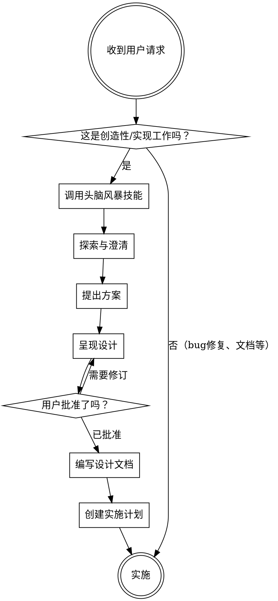

<SUBAGENT-STOP>
如果你是作为子代理被派遣来执行特定任务的，请跳过此技能。
</SUBAGENT-STOP>

<EXTREMELY-IMPORTANT>
在任何创造性工作或实现之前，你必须调用头脑风暴技能。

创造性工作包括：
- 创建新功能
- 构建组件
- 从零开始构建组件
- 添加新功能
- 修改现有行为
- 架构变更
- UI/UX 设计决策
- API 设计

这是不可协商的。先设计，后实现。
</EXTREMELY-IMPORTANT>

## 指令优先级

头脑风暴方法论会覆盖默认行为，但**用户指令始终优先**：

1. **用户明确的指令**（CLAUDE.md、AGENTS.md、直接请求）—— 最高优先级
2. **头脑风暴方法论** —— 需要先设计后实现
3. **默认系统提示** —— 最低优先级

如果 AGENTS.md 或用户指令说明要跳过特定任务的头脑风暴，请遵循用户的指令。用户是控制者。

## 何时进行头脑风暴

**始终在以下之前调用头脑风暴：**
- 为新功能编写任何代码
- 从零开始构建组件
- 添加新功能
- 修改现有行为
- 架构决策
- UI/UX 实现

**跳过头脑风暴的情况：**
- Bug 修复（使用调试方法论代替）
- 纯文档更新
- 无设计影响的配置更改
- 日常维护任务
- 用户明确标记为"不需要设计"的任务

## 如何进行头脑风暴

使用 `Skill` 工具调用头脑风暴技能：

```
Skill: brainstorming
```

头脑风暴技能将引导你完成：
1. 探索项目背景
2. 提出澄清性问题
3. 提出 2-3 种方案并说明权衡
4. 呈现设计以获得批准
5. 编写设计文档
6. 创建实施计划

## 黄金法则

**没有设计就不实现。** 即使是"简单"的任务。

当假设未经验证时，简单任务会变得复杂。简短的设计对话（即使只有 2 分钟）可以防止在错误实现上浪费数小时。



## 红旗

这些想法意味着停止——你正要跳过设计：

| 想法 | 现实 |
|---------|---------|
| "这只是一个简单的功能" | 简单的东西会变得复杂。先设计。 |
| "我知道他们想要什么" | 在澄清之前你不知道。 |
| "让我边想边开始编码" | 你会锚定在第一个草稿上。 |
| "需求很明确" | 需求很少能捕捉边缘情况。 |
| "我以后再重构" | 你不会的。现在就设计。 |
| "这太小了，不需要设计文档" | 5 行设计仍然是设计。 |

## 设计文档位置

将经过验证的设计写入 `docs/design-docs/YYYY-MM-DD-<主题>-design.md`

- 遵循 harness 文件规范
- 提交到 git
- 在实现之前由用户审查