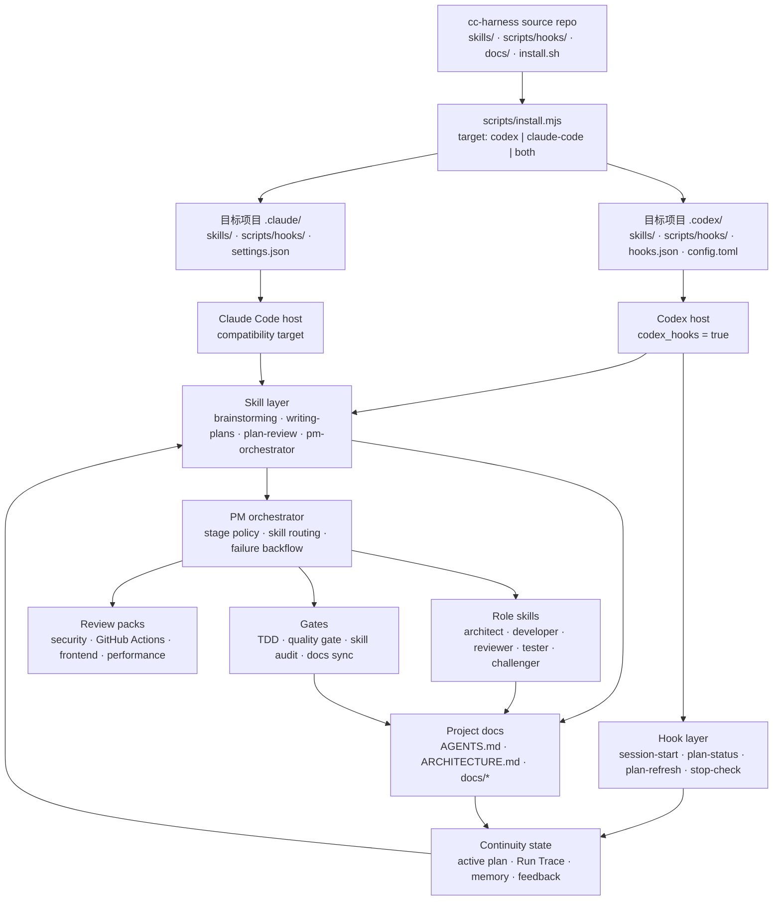

# cc-harness

`cc-harness` 是一套文档优先的 AI 协作 harness。仓库只维护可复用的 `skills/`、`scripts/hooks/`、安装脚本和文档；Claude Code 与 Codex 的运行目录由安装脚本写入目标项目，不作为仓库事实源提交。

## 核心愿景

`cc-harness` 的目标不是一组零散 prompt，而是把 Codex 协作变成一个可恢复、可审查、可持续演进的工程系统。

它以 `docs/`、`AGENTS.md`、`ARCHITECTURE.md` 作为任务执行和项目演进的知识库，用 hooks、skills、rules 约束模型行为，让 Codex 在项目里先读对文档、沿着正确 workflow 前进、在长任务中保持 Run Trace，并把实现、review、test、docs sync 和 feedback 收口回仓库事实源。

当前分支的定位是 **docs-first harness + PM 调度层 + role/review skill 基础层**。它已经能把 brainstorming、planning、plan review、developer、TDD、tester、review packs、quality gate 和 install smoke 串成一套可执行方法论；下一阶段重点是把这些方法论产品化成稳定的 eval、CI/CD、UI/e2e 和工具化 review 闭环。

`cc-harness` 同时服务两类 AI coding 场景：

- **Vibe coding**：小功能、问题修复、UI 微调或局部重构时，提供轻量 skills、memory、docs sync 和 quality gate，帮助维护文件与产出质量，而不把小任务过度流程化。
- **AI coding**：长任务从需求和设计澄清、计划编写、计划审核、开发、TDD、测试、代码审查、文档同步到交付门禁，逐步由 `/pm-orchestrator` 按风险和项目状态调度。目标形态仍是“一条命令，从需求到上线”，但当前分支还没有完整 CI/CD、PR 和发布自动化 runtime。

## 当前能力

### 已经落地

- **Source-first installer**：`install.sh` / `scripts/install.mjs` 将 source repo 的 skills、hooks 和 host config 投射到目标项目的 `.codex/`、`.claude/`。
- **Codex-first runtime compatibility**：Codex 使用独立 `.codex/hooks.json`、`.codex/config.toml` 和 JSON hook protocol；Claude Code 作为兼容 target 支持。
- **PM over role skills**：`/pm-orchestrator` 负责阶段控制、skill routing、失败回流、并行/串行策略、operation risk 和交付 gate 编排。
- **Planning gate**：`/brainstorming`、`/writing-plans`、`/plan-review` 形成需求探索、计划编写、fresh-eyes plan review 的轻量流程。
- **Implementation discipline**：`/developer` 是 PM 调度下的轻量 slice executor，负责技术栈识别、repo 约定读取、TDD evidence 和最小实现。
- **TDD protocol**：`/tdd` 定义 RED/GREEN/REFACTOR、acceptance coverage、TDD exception 和 evidence 输出。
- **Review packs**：在 `/reviewer` 之外提供 `/review-security`、`/review-github-actions`、`/review-frontend`、`/review-performance` 四个专项 pack。
- **Verification layer**：`/tester` 探测测试、lint、typecheck、build 入口；`/harness-quality-gate` 在阶段收尾前汇总验证、docs impact 和剩余风险。
- **CI/CD gate foundation**：`/ci-cd-gate` 读取 GitHub Actions PR checks 和失败日志，输出只读 gate result 和 PM backflow；自动 rerun、push、merge、deploy 仍属于后续 operation gate。
- **Skill governance**：`docs/references/skill-standard.md`、`/skill-audit`、`scripts/checks/skill-standard.mjs` 提供 skill 标准和仓库健康检查。
- **AI install workflow**：`docs/install-ai.md` 和 README 安装提示词支持把安装任务交给另一个 AI coding agent 执行，并要求严格验证。

### 仍在建设

- **harness eval suite**：还缺 repo-local 回归测试，用固定临时项目和提示词持续验证 PM、developer、TDD、tester、review packs 和 installer 没有退化。
- **CI/CD and PR loop**：已有只读 `/ci-cd-gate` 基础；还缺自动 rerun、PR comment、push fix、merge/deploy 和多 provider CI/CD runtime。
- **UI/e2e/UAT**：还缺专门的 `/ui-verify` 或 `/e2e-tester`，把 Playwright、截图、a11y、responsive 和交互状态纳入一等验证。
- **Tool-backed review packs**：当前 review packs 主要是专家审查协议；后续应接入 Semgrep、Gitleaks、zizmor、actionlint、Lighthouse、axe 等工具。
- **Traceability**：还需要把 spec / plan / task / TDD / tester / review evidence 串成更稳定的可追踪记录。
- **Distribution and sync**：还缺更正式的版本化发布、三方 skill 导入、license 检查和 marketplace / catalog 同步策略。

## 核心原则

- **Source-first**：仓库只维护 `skills/`、`scripts/hooks/`、`docs/` 和 installer；`.codex/`、`.claude/` 是安装产物。
- **Docs-first**：AGENTS、architecture、plans、memory、feedback 和 specs 是 Codex 协作的操作界面，不是事后补充说明。
- **Codex-first compatibility**：优先保证 Codex runtime 的 hook 协议、skills 布局和安装结果可用，同时兼容 Claude Code。
- **Recoverable workflows**：长任务通过 active exec plan、Run Trace、Goal Contract 和 hook 回注维持连续性，避免计划漂移。
- **PM over role skills**：角色能力以普通 skills 表达；`/pm-orchestrator` 负责调度，而不是把流程硬编码进单个角色。
- **Open-source leverage**：吸收高质量开源项目的方法论和工具，但以本仓库的 docs-first、Codex-first 架构重新整合。

## 架构



## 仓库布局

| 区域 | 路径 | 用途 |
|------|------|------|
| Skills | [skills/](skills/) | workflow 入口、role skills、review packs、harness 工具 |
| Hooks | [scripts/hooks/](scripts/hooks/) | planning、memory、stop check 辅助 hook |
| Checks | [scripts/checks/](scripts/checks/) | Skill Standard 等仓库健康检查脚本 |
| Installer | [install.sh](install.sh), [scripts/install.mjs](scripts/install.mjs) | 安装到 Claude Code 或 Codex 项目 |
| Docs | [docs/](docs/) | 方法论、规格、memory、反馈、参考资料和执行计划 |

仓库不得重新提交 `.claude/`、`.codex/`、`.claude-plugin/`、`examples/`、`fixtures/` 或 `agents/` 目录。这些目录属于 runtime 或 install output。

## 安装

在本地 checkout 中运行：

```bash
./install.sh --target both --dest /path/to/project
```

可选 target：

```bash
./install.sh --target claude-code --dest /path/to/project
./install.sh --target codex --dest /path/to/project
./install.sh --target both --dest /path/to/project
```

安装器会把 `skills/` 和 `scripts/hooks/` 复制到目标 runtime 目录，并写入对应 host 需要的 hook config：

| Target | 生成目录 | Config |
|--------|----------|--------|
| Claude Code | `<project>/.claude/` | `.claude/settings.json` |
| Codex | `<project>/.codex/` | `.codex/config.toml`, `.codex/hooks.json` |

面向 AI 的安装说明在 [docs/install-ai.md](docs/install-ai.md)。可以把这份文档发给另一个 AI coding agent，让它把 `cc-harness` 安装到目标项目。

### 复制给 Codex 的安装提示词

把下面这段复制到 Codex，并把目标项目路径替换成你的项目路径：

```text
请把 cc-harness 安装到这个目标项目：

<TARGET_PROJECT_PATH>

请先阅读并遵循安装说明：
https://github.com/HumbleMaxiu/cc-harness/blob/codex/subagent-skill/docs/install-ai.md

要求：
- 不要把安装说明内容复述给我，按文档执行即可。
- 如果本机没有 cc-harness checkout，请按文档在临时目录 clone 指定分支后安装。
- 安装 target 使用 both，除非我另行指定只安装 codex 或 claude-code。
- 安装后运行文档里的严格验证，确认 .codex 和 .claude 的关键 runtime 文件都存在。
- 最后告诉我执行的命令、安装到哪里、验证是否通过、是否有失败或需要我处理的事项。
```

## Skills

### Workflow Skills

| Skill | 用途 |
|-------|------|
| `/brainstorming` | 创造性工作前的需求和设计探索 |
| `/writing-plans` | 多步骤任务计划 |
| `/plan-review` | 实现前的只读计划审核 gate，由 `/pm-orchestrator` 按风险调度 |
| `/pm-orchestrator` | PM 总控层，负责阶段控制、skill 分配、失败回流、并行/串行策略和交付 gate 编排 |
| `/tdd` | RED/GREEN/REFACTOR 纪律，供 `/developer` 在行为变更中调用 |
| `/follow-goal` | 长跑任务的 durable objective、停止条件和 checkpoint 执行协议 |
| `/doc-sync` | 文档影响分析、同步和索引维护 |
| `/plan-persist` | active plan / Run Trace 的轻量持续化 |
| `/harness-setup` | 为项目生成或更新 harness 文档骨架 |
| `/harness-guide` | 根据场景推荐 workflow |
| `/harness-help` | 查看入口和命令索引 |
| `/harness-audit` | 检查 harness 健康状态 |
| `/harness-quality-gate` | 交付前质量门禁 |
| `/ci-cd-gate` | 读取 GitHub Actions PR checks 和失败日志，判断 CI/CD 是否阻断交付，并把失败回流给 PM 可调度的实现、测试或 review skills |
| `/feedback` | 分诊并记录长期用户反馈 |
| `/feedback-query` | 查询 feedback history 和 recurrence |
| `/skill-creator` | 创建、改进或审计 Skill |
| `/skill-audit` | 按 Skill Standard 审计 Skill，供用户和 PM gate 调度 |

### Role And Review Skills

| Skill | 用途 |
|-------|------|
| `/architect` | 计划检查、docs impact 判断、文档同步 gatekeeping |
| `/challenger` | 对计划、claim、API 假设和完成声明做对抗式验证 |
| `/developer` | PM 调度下的轻量实现者，负责单 slice 实现、技术栈识别和 TDD 证据输出 |
| `/reviewer` | 默认代码质量和安全审查 |
| `/review-security` | 安全专项审查 pack，覆盖 auth、secrets、injection、tenant boundary 和 dependency risk |
| `/review-github-actions` | GitHub Actions 专项审查 pack，覆盖 workflow 安全和 AI agent action 风险 |
| `/review-frontend` | 前端专项审查 pack，覆盖 UI 状态、a11y、responsive、forms 和 interaction risk |
| `/review-performance` | 性能专项审查 pack，覆盖 hot path、queries、cache、bundle、large lists 和 expensive render/computation |
| `/tester` | 探测并执行测试、lint、typecheck、build 等验证 |
| `/feedback-curator` | 维护 role/self-check feedback memory 与 recurrence |

## 典型流程

1. 新项目先运行 `/harness-setup` 生成文档骨架。
2. 新功能先进入 `/brainstorming`，再用 `/writing-plans` 写清范围和验收。
3. 执行阶段进入 `/pm-orchestrator`，由 PM 判断是否先调度 `/plan-review`。
4. 行为变更由 `/developer` 按 PM 分配的 slice 执行，并调用 `/tdd` 或记录 TDD exception。
5. 审查阶段先走 `/reviewer`，再由 PM 按风险追加 security、GitHub Actions、frontend、performance review packs。
6. 验证阶段由 `/tester` 探测并运行测试、lint、typecheck、build。
7. 有 PR 或远端 CI/CD 语境时运行 `/ci-cd-gate`，读取 GitHub Actions checks 和失败日志并决定回流。
8. 文档受影响时运行 `/doc-sync`。
9. 交付前运行 `/harness-quality-gate`。
10. 可复用反馈通过 `/feedback` 或 `/feedback-curator` 沉淀到 memory。

长跑迁移、大重构或实验任务可以先用 `/follow-goal` 建立 Goal Contract，再进入 `/pm-orchestrator` 或 Codex 原生 `/goal`。

## 开发验证

当前仓库还没有完整 repo-local eval suite。常用手动验证：

```bash
node scripts/checks/skill-standard.mjs
./install.sh --target both --dest <target-project>
```

`skill-standard.mjs` 会对历史 skill 输出 warnings；`ERROR` 为 0 表示基础 frontmatter / source attribution 可用。需要做 install smoke check 时，运行安装命令后检查生成的 Claude Code / Codex runtime 文件。

针对流程行为，当前推荐用临时项目和子 agent 做 smoke test，覆盖 `/pm-orchestrator`、`/developer`、`/tdd`、`/tester` 和 review packs。后续应把这类测试沉淀为 `harness-eval`。

## 重要文档

- [架构](ARCHITECTURE.md)
- [项目总览](docs/guides/project-overview.md)
- [Harness 指南](docs/guides/harness-guide.md)
- [AI 安装说明](docs/install-ai.md)
- [Role Skill 产品规格](docs/product-specs/agent-system.md)
- [Skill 标准](docs/references/skill-standard.md)
- [Skill 标准调研](docs/references/skill-standard-research.md)
- [Run Trace Protocol](docs/references/run-trace-protocol.md)
- [Review Pack Registry](docs/references/review-pack-registry.md)
- [Review Packs Design](docs/superpowers/specs/2026-05-18-review-packs-design.md)
