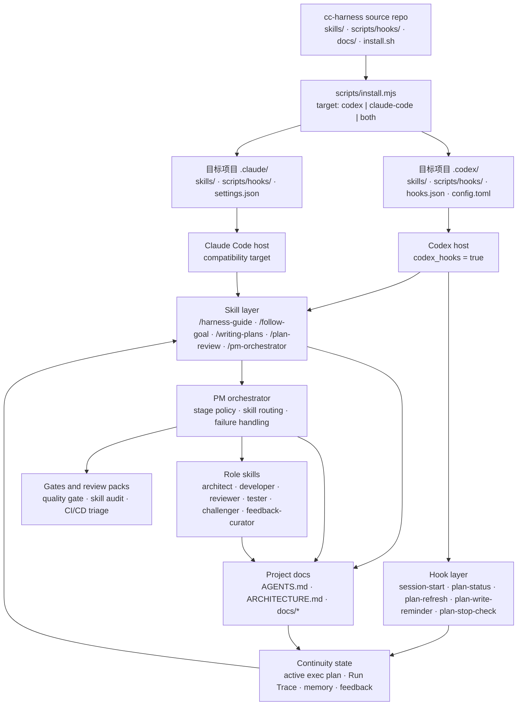

# cc-harness

`cc-harness` 是一套文档优先的 AI 协作 harness。仓库本身只维护可复用的 `skills/`、`scripts/hooks/`、安装脚本和文档；Claude Code 与 Codex 所需的运行目录由安装脚本写入目标项目，不再作为仓库镜像保存。

## 核心愿景

`cc-harness` 的目标不是做一组零散 prompt，而是基于 OpenAI harness engineering 实践，把 Codex 协作变成一个可恢复、可审查、可持续演进的工程系统。

它以 `docs/`、`AGENTS.md`、`ARCHITECTURE.md` 作为项目演进和任务执行的知识库，用 hooks、skills、rules 约束模型行为，让 Codex 在项目里先读对文档、沿着正确 workflow 前进、在长任务中保持 Run Trace，并把实现、review、test、docs sync 和 feedback 都收口回仓库事实源。

`cc-harness` 同时服务两类 AI coding 场景：

- **Vibe coding**：用户和模型协作完成小功能、问题修复、UI 微调或局部重构时，harness 提供轻量 skills、memory、docs sync 和 quality gate，帮助维护文件与产出质量，而不把小任务过度流程化。
- **AI coding**：用户从 command 或 skill 进入长任务时，harness 逐步覆盖从需求和设计澄清、计划编写、计划审核、开发、TDD、UI 还原、测试、代码审查到 CI/CD 的完整流程。目标形态是由 PM orchestrator 根据任务风险和项目状态分配应该使用哪些 skills、哪些阶段需要哪些角色、代码审查严格程度、测试/审查失败后的处理方案，最终实现“一条命令，从需求到上线”。

Claude Code 仍作为兼容 host 支持，但当前分支的核心设计会优先保证 Codex runtime 的 hook 协议、skills 布局和安装结果可用。

核心原则：

- **Source-first**：仓库只维护 `skills/`、`scripts/hooks/`、`docs/` 和 installer；`.codex/`、`.claude/` 是安装产物，不是 source of truth。
- **Docs-first**：AGENTS、architecture、plans、memory、feedback 和 specs 是 Codex 协作的操作界面，不是事后补充说明。
- **Codex-first compatibility**：Codex 使用独立 `.codex/hooks.json`、`.codex/config.toml` 和 JSON hook protocol；不把 Claude hook 语义硬套给 Codex。
- **Recoverable workflows**：长任务通过 active exec plan、Run Trace、Goal Contract 和 hook 回注维持连续性，避免计划漂移。
- **PM over role skills**：角色能力以普通 skills 表达，`/pm-orchestrator` 负责阶段控制、skill 分配、失败回流、并行/串行策略，并按需调度 architect、developer、reviewer、tester、challenger 和 feedback-curator。
- **Open-source leverage**：站在 GitHub 开源生态和成熟工程实践之上，把可复用资源整合成符合本项目质量、流程和交付要求的 harness。

## 架构图



## 包含内容

| 区域 | 路径 | 用途 |
|------|------|---------|
| Skills | [skills/](skills/) | workflow 入口、role skill、harness 工具 skill |
| Hooks | [scripts/hooks/](scripts/hooks/) | planning、memory、stop check 辅助 hook |
| Checks | [scripts/checks/](scripts/checks/) | Skill 标准等仓库健康检查脚本 |
| Installer | [install.sh](install.sh), [scripts/install.mjs](scripts/install.mjs) | 将 skills 和 hooks 安装到 Claude Code 或 Codex 项目 |
| Docs | [docs/](docs/) | 方法论、规格、memory、反馈和使用指南 |

仓库不会提交 `.claude/`、`.codex/`、`.claude-plugin/`、`examples/` 或 `fixtures/` 目录。这些目录属于 runtime 或 install output，不是事实来源。

## 安装

在本地 checkout 中运行：

```bash
./install.sh --target both --dest /path/to/project
```

可选 target：

```bash
./install.sh --target claude-code --dest /path/to/project
./install.sh --target codex --dest /path/to/project
./install.sh --target both --dest /path/to/project
```

安装器会把 `skills/` 和 `scripts/hooks/` 复制到目标 runtime 目录，并写入对应 host 需要的 hook config：

| Target | 生成目录 | Config |
|--------|---------------------|--------|
| Claude Code | `<project>/.claude/` | `.claude/settings.json` |
| Codex | `<project>/.codex/` | `.codex/config.toml`, `.codex/hooks.json` |

面向 AI 的安装说明在 [docs/install-ai.md](docs/install-ai.md)。可以把这份文档发给另一个 AI coding agent，让它把 `cc-harness` 安装到目标项目。

## 核心 Skills

| Skill | 用途 |
|-------|---------|
| `/brainstorming` | 创造性工作前的需求和设计探索 |
| `/writing-plans` | 多步骤任务计划 |
| `/plan-review` | 实现前的只读计划审核 gate，由 `/pm-orchestrator` 按风险调度 |
| `/pm-orchestrator` | PM 总控层，按阶段分配 skills、组织实现/审查/测试/文档同步、处理失败回流和并行/串行策略 |
| `/follow-goal` | 长跑任务的 durable objective、停止条件和 checkpoint 执行协议 |
| `/doc-sync` | 文档影响分析、同步和索引维护 |
| `/plan-persist` | active plan / Run Trace 的轻量持续化 |
| `/harness-setup` | 为项目生成或更新 harness 文档骨架 |
| `/harness-help` | 查看入口和命令索引 |
| `/harness-guide` | 按场景推荐 workflow |
| `/harness-audit` | 检查 harness 健康状态 |
| `/harness-quality-gate` | 交付前质量门禁 |
| `/feedback` | 分诊并记录长期用户反馈 |
| `/feedback-query` | 查询 feedback history 和 recurrence |
| `/skill-creator` | 创建、改进或审计 Skill |
| `/skill-audit` | 按 Skill Standard 审计一个或多个 Skill，供用户和 PM gate 调度 |

## Role Skills

旧的独立角色定义已经转换为普通 Skill：

| Role Skill | 用途 |
|------------|---------|
| `/architect` | 计划检查、docs impact 判断、文档同步 gatekeeping |
| `/challenger` | 对计划、claim、API 假设和完成声明做对抗式验证 |
| `/developer` | 按计划和 TDD 约束执行实现 |
| `/reviewer` | 代码质量和安全审查 |
| `/tester` | 探测并执行测试、lint、typecheck、build 等验证 |
| `/feedback-curator` | 维护 role/self-check feedback memory 与 recurrence |

`/pm-orchestrator` 通过这些 role skill 组织流程，并负责选择阶段、分配 skill、收集 evidence、处理失败回流，不再依赖 host-specific role definition files。

## 典型流程

1. 新项目先运行 `/harness-setup` 生成文档骨架。
2. 新功能先进入 `/brainstorming`，再用 `/writing-plans` 写清范围和验收。
3. 执行阶段进入 `/pm-orchestrator`，由 PM 判断是否先调度 `/plan-review`，再分配实现、review、test、docs sync 和 gate。
4. 文档受影响时运行 `/doc-sync`。
5. 交付前运行 `/harness-quality-gate`。
6. 可复用反馈通过 `/feedback` 沉淀到 memory。

长跑迁移、大重构或实验任务可以先用 `/follow-goal` 建立 Goal Contract，再进入 `/pm-orchestrator` 或 Codex 原生 `/goal`。

## 开发验证

当前仓库没有完整 repo-local test script。常用手动验证：

```bash
node scripts/checks/skill-standard.mjs
./install.sh --target both --dest <target-project>
```

`skill-standard.mjs` 第一版会对历史 skill 输出 warnings，但 `ERROR` 为 0 才表示基础 frontmatter / source attribution 可用。需要做 install smoke check 时，运行安装命令后检查生成的 Claude Code / Codex runtime 文件。

用户或 PM orchestrator 需要解释这些检查结果时，使用 `/skill-audit`；它会区分 `ERROR`、`WARNING`、strict mode 和历史迁移债。

## 文档

- [架构](ARCHITECTURE.md)
- [项目总览](docs/guides/project-overview.md)
- [Harness 指南](docs/guides/harness-guide.md)
- [AI 安装说明](docs/install-ai.md)
- [Role Skill 产品规格](docs/product-specs/agent-system.md)
- [Skill 标准](docs/references/skill-standard.md)
- [Skill 标准调研](docs/references/skill-standard-research.md)
- [Review Pack Registry](docs/references/review-pack-registry.md)
