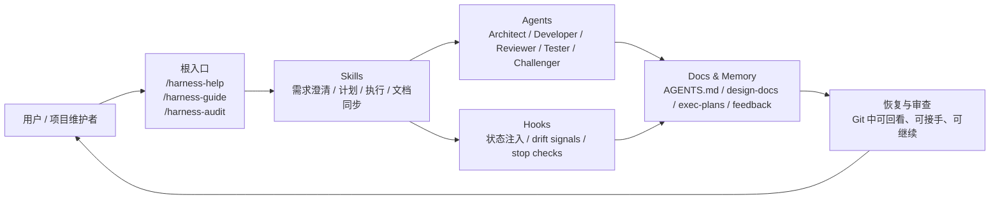
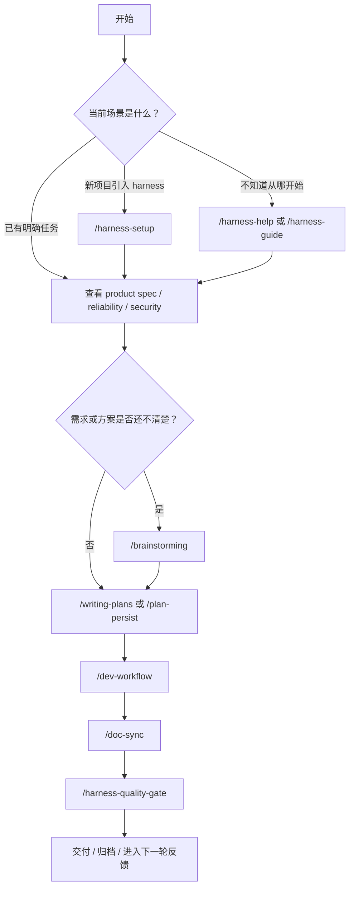

# Project Overview — cc-harness

> 面向首次接触者和维护者的总览：这个项目是什么、解决什么问题、由哪些部分组成，以及接下来往哪里演进。

## 项目是什么

`cc-harness` 是一个面向 Claude Code 的 harness engineering 插件仓库，用来把“AI 如何在项目里协作”这件事做成一套可复用、可审查、可恢复的工程约束。

它不是新的执行引擎，也不是独立的后端服务。它更像一套产品化的协作骨架：通过 `skills`、`agents`、`hooks`、文档结构和 memory 规则，把 AI 协作从“临时 prompt”升级成“仓库内可持续运行的工作系统”。

## 它解决什么问题

很多 AI 协作失败并不是模型本身不够强，而是缺少稳定入口、状态事实源和可执行约束。`cc-harness` 重点针对下面这些高频问题：

| 问题 | 当前解法 |
|------|----------|
| 先写代码后思考 | `/brainstorming` + `/writing-plans` + `AGENTS.md` hard gate |
| 计划漂移 | `docs/exec-plans/active/`、Run Trace、`/plan-persist`、planning hooks |
| 验证缺失 | `/dev-workflow`、Reviewer / Tester / Challenger、`/harness-quality-gate` |
| 文档腐坏 | `/doc-sync`、文档索引、consistency checks |
| 反馈无法沉淀 | `/feedback`、memory、recurrence、skill promotion 路径 |
| 恢复困难 | SessionStart memory 注入、exec plan 回注、长期文档事实源 |

## 为谁服务

| 用户 | 典型诉求 |
|------|----------|
| AI-first 开发者 | 想让 AI 在仓库里更稳定地完成任务，而不是每次重新解释规则 |
| Harness 新用户 | 想快速起步，不想先读一大堆零散规范 |
| 团队 lead | 想统一 AI 协作方式、交接格式和质量门禁 |
| 仓库维护者 | 想把规则、计划、反馈和恢复点都放进 Git，而不是散落在聊天里 |

## 核心组成

| 组成 | 作用 | 代表内容 |
|------|------|----------|
| Skills | 负责编排工作流和入口体验 | `/brainstorming`、`/writing-plans`、`/dev-workflow`、`/doc-sync` |
| Agents | 负责角色分工和交接契约 | Architect、Developer、Reviewer、Tester、Challenger、Feedback Curator |
| Hooks | 负责在会话生命周期里注入提醒、状态和 guardrail | SessionStart、PreToolUse、PostToolUse、Stop |
| Docs + Memory | 负责沉淀长期事实、计划状态和反馈 | `AGENTS.md`、`ARCHITECTURE.md`、`docs/exec-plans/`、`docs/memory/` |

## 系统协同图



这张图表达的是项目的基本哲学：AI 协作不只依赖 prompt，而是依赖一整套入口、角色、状态和文档层的配合。

## 典型工作流



如果你把这条流程看成“先明确、再执行、再验证、再沉淀”，基本就是 `cc-harness` 想强制建立的协作节奏。

## 仓库结构速览

```text
cc-harness/
├── AGENTS.md                 # 项目级行为规则与文档导航
├── ARCHITECTURE.md           # 顶层技术地图
├── README.md                 # 外部入口与安装说明
├── agents/                   # Agent 定义镜像
├── skills/                   # Skill 定义与工作流入口
├── scripts/hooks/            # Node.js hooks 实现
├── docs/
│   ├── guides/               # 用户指南与总览文档
│   ├── product-specs/        # 领域规格
│   ├── design-docs/          # 设计文档
│   ├── exec-plans/           # 执行计划与完成记录
│   ├── memory/               # 长期记忆与反馈
│   └── references/           # 参考协议与评估材料
└── .claude/ / .codex/        # Claude Code / Codex 兼容镜像
```

## 当前能力地图

| 能力层 | 入口 | 解决的问题 |
|--------|------|------------|
| Discoverability | `/harness-help`、`/harness-guide` | 用户不知道从哪里开始 |
| Planning | `/brainstorming`、`/writing-plans`、`/plan-persist` | 需求模糊、范围不清、长任务容易漂移 |
| Execution | `/dev-workflow` | 实现、审查、验证缺少闭环 |
| Documentation | `/doc-sync` | 代码和文档容易脱节 |
| Audit / Gate | `/harness-audit`、`/harness-quality-gate` | 缺少交付前健康检查和证据门禁 |
| Retention | `/feedback`、memory、recurrence | 反馈留不下来，重复问题难升级 |

## 后续开发功能

下面这些方向都已经在现有路线图和方法论里有明确依据，适合作为接下来持续推进的功能增强。

### 1. 更强的 audit 信号

重点不是再加一个“检查命令”，而是让审计结果更像可执行证据。下一步会继续扩展：

- 文档新鲜度：文档是否跟最近的变更保持同步
- workflow completeness：一次任务是否真的经过计划、执行、审查、测试和同步
- evidence strength：完成声明背后是否有足够验证证据，而不只是口头声称

### 2. 更稳定的 Challenger 接入

`Challenger` 已经存在，但后续会继续强化它在 `dev-workflow` 里的接入时机和触发条件，减少“该挑战时没挑战，不该挑战时又增加阻力”的不稳定性。

重点会放在：

- 复杂 claim 的识别
- 外部 API 假设的显式挑战
- 计划和完成声明的门禁稳定化

### 3. 更聪明的 harness-setup 推荐

`harness-setup` 已经支持 `light`、`standard`、`strict` 三种 profile。下一步会进一步提升它的推荐质量，让它不只判断“生成多少约束”，还判断“该生成哪些 shared skill / project-local skill 组合”。

这会让 scaffold 更贴近真实项目，而不是一套固定大模板。

### 4. Memory 到 Skill 的自动升级

现在仓库已经建立了 feedback / recurrence 到 `Skill Promotion Candidate` 的路径，后续方向是把这个过程变得更自动：

- 自动识别高频反馈模式
- 更早提示“这已经不是单次问题，而是应该沉淀成 skill / check”
- 缩短从经验到产品能力的升级路径

## 后续方向

如果从更长的产品演进角度看，`cc-harness` 后续会继续朝三个方向加强。

### Constraint 可执行化

把方法论继续从“写在文档里”升级成“可被 workflow、hook 和 check 实际执行”。目标是减少用户靠记忆遵守规则的负担。

### Adaptive Harness

让不同项目拿到不同强度但同一架构的信息系统。小项目不被过度框架化，复杂项目也不会因为默认骨架过浅而失控。

### 产品叙事更清晰

对外介绍会越来越少强调“有多少文档、多少 skill”，而更多围绕真实痛点来解释产品价值，比如计划漂移、验证缺失、恢复困难和经验沉淀。

## 怎么开始使用

| 场景 | 建议起点 |
|------|----------|
| 第一次了解这个仓库 | 先看这篇总览，再读 [Harness Guide](./harness-guide.md) |
| 想在新仓库引入 harness | 从 `/harness-setup` 开始 |
| 想实际推进任务 | 从相关 spec 开始，再走 `/brainstorming` 或 `/writing-plans` |
| 想检查当前 harness 状态 | 用 `/harness-audit` |
| 准备交付或提交 | 用 `/harness-quality-gate` |

## 延伸阅读

- [README](../../README.md)
- [Harness Guide](./harness-guide.md)
- [ARCHITECTURE.md](../../ARCHITECTURE.md)
- [docs/PLANS.md](../PLANS.md)
- [docs/PRODUCT_SENSE.md](../PRODUCT_SENSE.md)
- [docs/HARNESS_METHODOLOGY.md](../HARNESS_METHODOLOGY.md)
- [Pain Point Matrix](../design-docs/2026-04-16-harness-pain-point-matrix.md)
