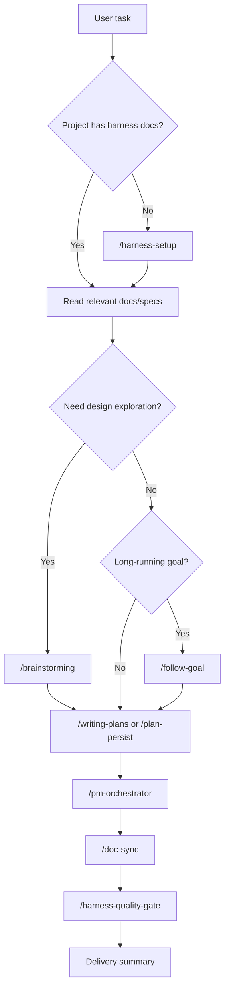

# 项目总览 — cc-harness

`cc-harness` 将 AI 协作规则沉淀为仓库内的 skills、hooks、docs 和 memory。仓库刻意保持 source-first：不保存已生成的 Claude Code 或 Codex runtime folders。

## 解决的问题

| 问题 | cc-harness 的解法 |
|---------|-------------------|
| 过早进入编码 | `/brainstorming`、`/writing-plans` 和 `AGENTS.md` rules |
| plan drift | exec plans、Run Trace、`/plan-persist` 和 hooks |
| 长跑任务缺少停止条件 | `/follow-goal` 的 Goal Contract、validation loop 和 checkpoint status |
| 验证不足 | `/pm-orchestrator`、role skills 和 `/harness-quality-gate` |
| docs 过时 | `/doc-sync` 和 docs indexes |
| feedback 丢失 | `/feedback`、feedback memory、recurrence records |
| 恢复困难 | memory docs、Run Trace 和 session-start context |

## Source Model

```text
cc-harness/
├── skills/          # workflow skills and role skills
├── scripts/hooks/   # shared hook scripts
├── install.sh       # host installer wrapper
└── docs/            # methodology, guides, specs, memory
```

Host runtime folders 会在目标项目中生成：

- Claude Code: `.claude/`
- Codex: `.codex/`

这些 folders 不提交到本仓库。

## Role Skills

开发角色都是普通 skills：

- `/architect`
- `/challenger`
- `/developer`
- `/reviewer`
- `/tester`
- `/feedback-curator`

`/pm-orchestrator` 通过结构化 handoffs 和 verification evidence 协调这些 role skills。

## 典型流程



## 安装

脚本化安装流程见 [面向 AI 的安装说明](../install-ai.md)。
