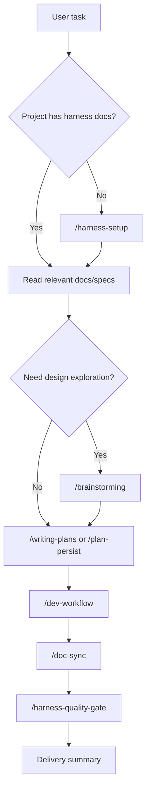

# Project Overview — cc-harness

`cc-harness` turns AI collaboration rules into repository-owned skills, hooks, docs, and memory. The repository is intentionally source-first: it does not store generated Claude Code or Codex runtime folders.

## What It Solves

| Problem | cc-harness Answer |
|---------|-------------------|
| jumping into code too early | `/brainstorming`, `/writing-plans`, and `AGENTS.md` rules |
| plan drift | exec plans, Run Trace, `/plan-persist`, and hooks |
| weak verification | `/dev-workflow`, role skills, and `/harness-quality-gate` |
| stale docs | `/doc-sync` and docs indexes |
| lost feedback | `/feedback`, feedback memory, recurrence records |
| hard recovery | memory docs, Run Trace, and session-start context |

## Source Model

```text
cc-harness/
├── skills/          # workflow skills and role skills
├── scripts/hooks/   # shared hook scripts
├── install.sh       # host installer wrapper
└── docs/            # methodology, guides, specs, memory
```

Host runtime folders are generated in the target project:

- Claude Code: `.claude/`
- Codex: `.codex/`

Those folders are not checked into this repository.

## Role Skills

The development roles are ordinary skills:

- `/architect`
- `/challenger`
- `/developer`
- `/reviewer`
- `/tester`
- `/feedback-curator`

`/dev-workflow` coordinates these role skills with structured handoffs and verification evidence.

## Typical Flow



## Installation

See [AI-Facing Installation Guide](../install-ai.md) for the script-based install flow.
