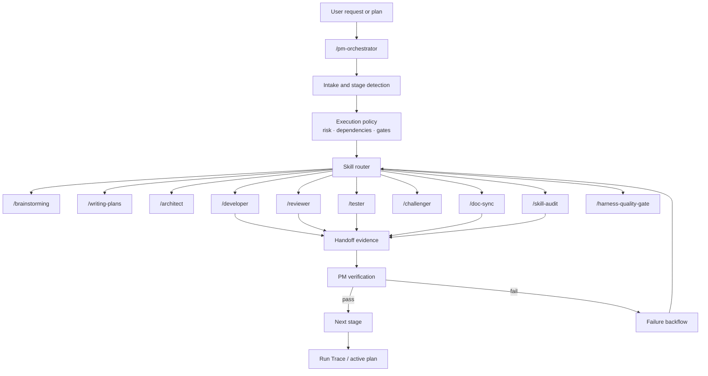

# PM Orchestrator Design

## Objective

Replace `/dev-workflow` with a Codex-first `/pm-orchestrator` skill that owns stage control, skill routing, failure backflow, and serial / parallel execution policy for both vibe coding and long AI coding workflows.

The PM layer should become the single execution control surface after `/writing-plans`, `/follow-goal`, or a user-provided implementation spec. Role skills remain useful, but they become assignable capabilities under PM control instead of being coordinated by `/dev-workflow`.

## Source References

- `am-will/swarms`: dependency-aware task waves, orchestrator-led validation, explicit worker boundaries, and Codex / Claude compatibility.
- `openai/skills`: Codex skill layout, frontmatter-triggered activation, installable skill portability.
- Codex `AGENTS.md` model: repo-local operating instructions remain the top-level runtime guide for Codex.
- Existing `cc-harness` docs-first model: `docs/`, `AGENTS.md`, `ARCHITECTURE.md`, active exec plans, Run Trace, feedback memory, and quality gates are the source of workflow truth.

## Non-Goals

- Do not vendor a full third-party workflow package.
- Do not introduce a separate `vendor-skills/` directory.
- Do not keep `/dev-workflow` as a normal public entry after migration.
- Do not require parallel subagents for correctness. PM orchestration must work in a single Codex session and may use subagents only when the host supports them and the work is safely separable.

## Architecture



## PM Responsibilities

`/pm-orchestrator` owns these decisions:

1. Determine the current stage: intake, requirements, planning, architecture, implementation, review, test, docs sync, feedback, quality gate, CI/CD, or final handoff.
2. Select skills for each stage based on task type, risk, available evidence, and user intent.
3. Decide serial vs parallel execution.
4. Maintain a PM Run Trace that records stage, assigned skills, files touched, commands run, evidence, failures, retry counts, and next resume point.
5. Route failures back to the correct skill and stop when the same failure repeats without new evidence.
6. Decide when review packs or `/skill-audit` should be added to the gate.
7. Produce a final summary that separates completed work, verification evidence, unresolved risks, and follow-up tasks.

## Skill Routing Policy

Default routing:

| Stage | Primary skill | Optional support |
|---|---|---|
| unclear goal / creative scope | `/brainstorming` | `/harness-guide` |
| implementation plan | `/writing-plans` | `/architect` |
| architecture and docs impact | `/architect` | `/challenger` |
| implementation | `/developer` | `/tester` for TDD signal |
| code review | `/reviewer` | review packs, `/challenger` |
| verification | `/tester` | `/harness-quality-gate` |
| skill changes | `/skill-creator` or direct edit | `/skill-audit` |
| docs impact | `/doc-sync` | `/architect` |
| feedback / recurrence | `/feedback-curator` | `/feedback`, `/feedback-query` |
| final release readiness | `/harness-quality-gate` | CI/CD review pack when available |

The PM should avoid invoking heavy workflow skills for tiny, well-scoped vibe coding tasks unless risk or ambiguity justifies it.

## Serial And Parallel Strategy

Serial execution is the default for:

- requirements, scope, and user confirmation
- risky writes
- architecture decisions
- implementation steps that touch overlapping files
- failure recovery
- final completion claims

Parallel execution is allowed only when all conditions are true:

- tasks have explicit, non-overlapping file ownership
- dependencies are satisfied
- each lane has a clear output contract
- a verification step exists after the wave
- the host supports safe delegation, or the same session can simulate lanes sequentially without losing traceability

PM wave format:

```markdown
### PM Wave
- wave_id:
- objective:
- mode: serial / parallel
- assigned_skills:
- lane_ownership:
- dependencies:
- expected_outputs:
- verification_after_wave:
```

## Failure Backflow

Failure routing rules:

| Failure | Backflow target |
|---|---|
| unclear requirement | `/brainstorming` or user confirmation |
| plan missing steps | `/writing-plans` |
| architecture/docs impact unclear | `/architect` |
| implementation bug | `/developer` |
| test failure due product behavior ambiguity | PM clarification, then `/developer` or `/tester` |
| test failure due test expectation drift | `/tester`, then PM decision |
| review finding | `/developer` or relevant review pack |
| missing docs update | `/doc-sync` |
| skill standard failure | `/skill-creator` then `/skill-audit` |
| repeated failure without new evidence | PM blocks and reports options |

PM should not loop indefinitely. After two failed attempts for the same root cause, it must summarize the blocker and ask for a decision unless the next corrective action is obvious and low-risk.

## Run Trace Contract

`/pm-orchestrator` should maintain:

```markdown
### PM Run Trace
- trace_id:
- source_request:
- current_stage:
- active_plan:
- assigned_skills:
- current_wave:
- files_touched:
- commands_run:
- evidence:
- failures:
- retry_count:
- docs_impact:
- feedback_impact:
- next_resume_action:
```

This trace can live in the active exec plan, final handoff, or a run-specific section depending on task size.

## Migration Scope

Remove `/dev-workflow` as the public execution entry:

- Delete `skills/dev-workflow/SKILL.md`.
- Replace references to `/dev-workflow` with `/pm-orchestrator`.
- Update README, AGENTS, ARCHITECTURE, guides, product specs, design docs, skill docs, and reference docs.
- Update `writing-plans` so completed plans hand off to `/pm-orchestrator`.
- Update `follow-goal` so long-running tasks resume through `/pm-orchestrator`.
- Update `doc-sync`, `harness-guide`, and `harness-setup` examples.
- Update skill-standard key skill lists in repo and bundled `skill-audit`.

Role skills stay in `skills/` and become assignable skills under PM control:

- `/architect`
- `/developer`
- `/reviewer`
- `/tester`
- `/challenger`
- `/feedback-curator`

## Validation

After implementation:

1. `rg -n "dev-workflow|/dev workflow|Dev Workflow" .` should have no active user-facing workflow references, except historical completed plan records if intentionally preserved.
2. `node scripts/checks/skill-standard.mjs --json` should report `0 errors`.
3. `node skills/skill-audit/scripts/skill-standard.mjs --skill pm-orchestrator --json` should report `0 errors`.
4. `./install.sh --target codex --dest <tmpdir>` should install `pm-orchestrator` and not install `dev-workflow`.
5. Installed Codex runtime should contain `.codex/skills/pm-orchestrator/SKILL.md`.
6. Documentation should describe PM as the owner of stage control and skill assignment.

## Open Decisions

- Historical completed exec plans may keep old `/dev-workflow` references as archival records, or be mass-rewritten for consistency. Recommended: preserve archival records and only update active product docs.
- `/harness-quality-gate` remains a gate skill, not the PM itself. PM decides when to run it.
- Review packs are scheduled by capability; the first implementation can reference the existing registry without implementing new packs.
