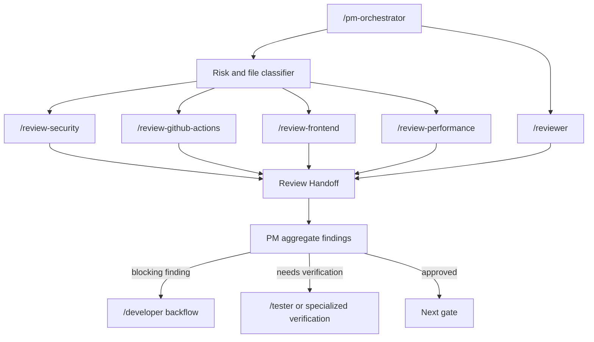

# Review Packs Design

## Objective

Add four lightweight, self-owned review packs that `/pm-orchestrator` can schedule alongside the existing `/reviewer`:

- `/review-security`
- `/review-github-actions`
- `/review-frontend`
- `/review-performance`

The goal is not to replace `/reviewer`. The base reviewer remains the default code quality gate. Review packs add focused, high-signal review behavior when the changed files or risk profile justify it.

## Design Principles

1. **Lightweight self-owned skills first.** Do not vendor third-party skills into `cc-harness` for the first version. Use public projects as references and tool integrations, with source attribution where ideas are adapted.
2. **High-confidence findings.** Packs should report blocking findings only when they can connect evidence to impact. The model is Sentry's security review pattern: research broader context, trace data flow, then report only when confidence is high.
3. **Capability-based routing.** PM routes packs by capability and risk, not by source project name.
4. **Tool-assisted but tool-optional.** Each pack can use mature open-source tools when installed, but must still produce a useful manual review when tools are absent.
5. **Shared handoff contract.** All packs return `Review Handoff`, so PM can aggregate findings consistently.
6. **No auto-fix in review packs.** Packs are read-only. Fixes route back to `/developer` or the relevant implementation skill.

## Source References

Reference projects and tools:

- Sentry `security-review`: high-confidence reporting, data-flow research before reporting, framework-aware false-positive suppression.
- Sentry `gha-security-review`: GitHub Actions external-attacker threat model, concrete exploitation scenario requirement, pwn request and expression injection checks.
- Trail of Bits `agentic-actions-auditor`: AI agent workflow discovery, prompt/input taint tracing, sandbox and allowlist risk analysis.
- Semgrep: optional security static-analysis tool for many languages.
- Gitleaks: optional secret scanning tool.
- OSV-Scanner: optional dependency vulnerability scanner.
- zizmor: optional GitHub Actions security scanner.
- actionlint: optional GitHub Actions lint and expression checker.
- axe-core, Pa11y, Lighthouse CI: optional frontend accessibility and web quality tools.
- size-limit / bundle analyzers: optional bundle and frontend performance checks.

These references inform local review behavior. They are not copied wholesale into the first implementation.

## Non-Goals

- Do not implement `/review-supply-chain` in this version. Dependency and lockfile risks are handled by `/review-security` as an optional dependency-security lane until CI/CD and release gates mature.
- Do not make every code review run every pack.
- Do not require external tools to be installed.
- Do not report theoretical or style-only issues as blocking security or performance findings.
- Do not create separate runtime directories, vendor folders, or third-party mirrors.

## Architecture



`/reviewer` runs when the task needs code review. PM adds specialized packs when file paths, changed behavior, or operation risk match the routing matrix.

## Shared Review Pack Contract

Each pack should include:

- `SKILL.md`
- `references/source.md`
- `references/pressure-scenarios.md`
- Optional focused reference files under `references/`

Each pack outputs:

```markdown
### Review Handoff
- capability:
- source_skill:
- review_scope:
- files_reviewed:
- context_read:
- tools_available:
- tools_run:
- findings:
  - id:
    severity: CRITICAL / HIGH / MEDIUM / LOW
    confidence: HIGH / MEDIUM / LOW
    blocking: true / false
    location:
    evidence:
    impact:
    recommendation:
    verification:
- needs_verification:
- reviewed_and_cleared:
- false_positive_notes:
- status: APPROVED / REJECTED / BLOCKED
```

Blocking findings require `HIGH` confidence unless the pack explicitly says why a `MEDIUM` confidence issue blocks release.

## Pack 1: `/review-security`

### Purpose

Find exploitable security vulnerabilities in application and infrastructure code.

### PM Triggers

PM should schedule `/review-security` when changes involve:

- authentication, authorization, permissions, tenant boundaries
- secrets, tokens, cryptography, sessions
- payment, billing, account ownership, admin actions
- request parsing, file upload/download, redirects, external requests
- SQL/NoSQL queries, shell execution, template rendering
- dependency or lockfile changes when no dedicated supply-chain pack exists

### Review Method

Use the Sentry high-confidence pattern:

1. Start from changed files and diff.
2. Research surrounding code to trace source, sink, and mitigations.
3. Distinguish attacker-controlled input from server-controlled config.
4. Check framework defaults before reporting.
5. Report only confirmed exploit paths as blocking findings.

Potential findings without a complete exploit path go to `needs_verification`, not `findings`.

### Optional Tool Slots

- `semgrep` for language-specific vulnerability patterns
- `gitleaks` for secrets
- `osv-scanner` for dependency vulnerabilities
- project-native security tests or linters

Tool output is evidence, not a substitute for data-flow reasoning.

### Pressure Scenarios

- SSRF-looking code uses deployment config, not user input: should not report.
- React renders user text with normal JSX escaping: should not report XSS.
- Raw SQL string interpolation uses request data: should report.
- Hardcoded private key appears in changed code: should report.
- Lockfile introduces a critical advisory reachable by runtime dependency: should report or needs verification depending on reachability evidence.

## Pack 2: `/review-github-actions`

### Purpose

Find exploitable GitHub Actions workflow vulnerabilities, including ordinary CI attacks and AI-agent workflow risks.

### PM Triggers

PM should schedule `/review-github-actions` when changes involve:

- `.github/workflows/*.yml` or `.yaml`
- `action.yml` / `action.yaml`
- `.github/actions/**`
- scripts, Makefiles, or config loaded by workflows
- AI coding agent actions in CI

### Threat Model

The default attacker:

- has no write access to the repository
- can open fork PRs
- can create issues and comments
- can control PR title, branch name, issue body, comment body, and PR content

Do not report issues that require repo write access unless the user explicitly asks for maintainer-threat or insider-threat review.

### General GHA Checks

Adopt the Sentry `gha-security-review` discipline:

- `pull_request_target` plus checkout or execution of fork-controlled code
- `${{ github.event.* }}` expression injection in `run:` blocks
- unauthorized `issue_comment` command workflows
- elevated `GITHUB_TOKEN`, PATs, deploy keys, or cloud secrets exposed to untrusted code
- config poisoning through PR-controlled files
- unpinned third-party actions where security sensitivity justifies it
- overbroad `permissions:`
- unsafe self-hosted runner, cache, or artifact patterns

High-confidence findings must include:

- entry point
- payload
- execution mechanism
- impact
- proof-of-concept sketch

### Agentic Actions Mode

If a workflow uses an AI agent action, enable an extra mode inspired by Trail of Bits `agentic-actions-auditor`.

Detect at least:

- `anthropics/claude-code-action`
- `google-github-actions/run-gemini-cli`
- `google-gemini/gemini-cli-action`
- `openai/codex-action`
- `actions/ai-inference`

Capture:

- trigger events
- prompt fields and prompt files
- env vars that include GitHub event data
- sandbox / safety strategy
- allowed users or bots
- allowed tools or CLI args
- token permissions and secrets

Check these vectors:

- attacker-controlled event data flowing through env vars into prompts
- direct expression injection into prompts
- prompts that fetch PR/issue/comment content at runtime
- `pull_request_target` with fork checkout
- CI logs or build output passed to the agent
- tool allowlists that still allow shell expansion or env leakage
- eval/exec of AI outputs
- dangerous sandbox configs such as `danger-full-access`, `--yolo`, or unsafe safety strategy
- wildcard user allowlists

Configuration weaknesses by themselves should be `LOW` or `Info` unless paired with an injection path.

### Optional Tool Slots

- `zizmor` for GitHub Actions security checks
- `actionlint` for syntax, expression, and shell-adjacent workflow lint
- `gh` for remote workflow fetch only when the user provides a GitHub repo and credentials are available

Fetched workflow YAML must be treated as data, never executed.

## Pack 3: `/review-frontend`

### Purpose

Review UI and frontend behavior changes for user-facing correctness, accessibility, and interaction risk.

### PM Triggers

PM should schedule `/review-frontend` when changes involve:

- UI components, pages, layouts, forms, or navigation
- loading, empty, error, optimistic, or disabled states
- responsive behavior
- keyboard interaction and focus management
- accessibility-sensitive components
- visual regressions or design-system changes

### Review Method

The pack reviews code and, when available, verification evidence. It does not replace `/tester` or `/ui-verify`.

Check:

- state transitions and stale state
- form validation and error display
- disabled, loading, empty, and failure states
- keyboard access and focus return
- labels, names, roles, and semantic HTML
- responsive constraints and text overflow risk
- user-visible copy consistency
- design-system consistency
- test or story coverage for important UI states

### Optional Tool Slots

- `axe-core` or Pa11y for accessibility evidence
- Playwright or local webapp testing for interaction evidence
- browser screenshots when visual regression risk is high
- project-native component tests or storybook checks

### Pressure Scenarios

- Button visually works but lacks accessible name: should report.
- Modal closes by mouse but traps keyboard focus incorrectly: should report.
- Loading path exists but submit button can double-submit: should report.
- Pure CSS spacing change with no interaction risk: likely non-blocking unless visual constraints break.

## Pack 4: `/review-performance`

### Purpose

Find high-signal performance risks introduced by code changes.

### PM Triggers

PM should schedule `/review-performance` when changes involve:

- hot paths, loops, queries, caching, pagination
- database access, API fan-out, background jobs
- frontend render paths, large lists, images, bundle size
- expensive computation or serialization
- dependency additions that may affect runtime or bundle size

### Review Method

First version is review-oriented, not a profiler. It should report only risks with clear evidence.

Check:

- N+1 queries or unbounded database reads
- missing pagination or limits
- unbounded loops over user-controlled or dataset-sized inputs
- cache key mistakes, stale invalidation, or accidental cache bypass
- repeated network calls or API fan-out
- synchronous expensive work on request/UI paths
- avoidable re-renders or unstable dependencies in frontend code
- large dependency or bundle additions
- image/media loading regressions

### Optional Tool Slots

- project-native benchmarks or performance tests
- Lighthouse CI for web performance
- `size-limit` or bundle analyzer for frontend bundle impact
- database explain plans when repo conventions support them
- profiling artifacts supplied by the user

### Pressure Scenarios

- New API loops through all tenant records without a limit: should report.
- React component recomputes expensive derived data every render with large inputs: should report if hot path evidence exists.
- New dependency adds large browser bundle impact: should report when bundle evidence exists.
- Micro-optimization without measured or clear risk: should not block.

## PM Scheduling Matrix

| Change Signal | Default Review | Additional Packs |
|---|---|---|
| ordinary code change | `/reviewer` | none |
| auth, permission, secrets, tenant boundary | `/reviewer` | `/review-security` |
| payment, billing, admin workflow | `/reviewer` | `/review-security` |
| `.github/workflows/**`, local actions | `/reviewer` | `/review-github-actions` |
| AI agent action in CI | `/reviewer` | `/review-github-actions` with agentic actions mode |
| UI components, pages, forms, visual behavior | `/reviewer` | `/review-frontend` |
| hot path, query, cache, bundle, large dependency | `/reviewer` | `/review-performance` |
| dependency or lockfile changes | `/reviewer` | `/review-security` dependency lane |

Multiple packs may run in parallel when they are read-only and have disjoint focus. PM aggregates their handoffs before deciding whether to backflow to `/developer`.

## Error Handling

- If required context is missing, a pack returns `BLOCKED` with the missing files or decision.
- If optional tools are unavailable, the pack records `tools_available: false` and continues manual review.
- If a tool fails, the pack records the command and failure, then decides whether manual review can continue.
- If confidence is medium, use `needs_verification` unless PM explicitly asks for advisory findings.
- If a pack finds an issue outside its capability, note it under `out_of_scope_notes` and let PM route another pack.

## Testing Strategy

Implementation should include pressure scenarios rather than large fixture suites.

Minimum pressure scenarios:

- `/review-security`: avoid false positive for server-controlled config; report user-controlled injection.
- `/review-github-actions`: report `pull_request_target` plus fork checkout; avoid flagging `workflow_dispatch` injection under the default external-attacker model; detect one AI-agent prompt taint path.
- `/review-frontend`: report missing accessible name or broken focus path; avoid blocking a harmless visual-only change.
- `/review-performance`: report unbounded query or loop; avoid blocking a theoretical micro-optimization.

Verification commands after implementation:

- targeted `/skill-audit` for each new pack
- full `node scripts/checks/skill-standard.mjs`
- install smoke for `.codex` and `.claude`
- one temporary project test where PM routes at least two packs and aggregates their handoffs

## Documentation Updates

Implementation should update:

- `README.md`
- `AGENTS.md`
- `docs/references/review-pack-registry.md`
- `docs/product-specs/skill-system.md`
- `docs/product-specs/agent-system.md`
- `docs/guides/harness-guide.md`
- `skills/pm-orchestrator/SKILL.md`

The registry should change candidate statuses to implemented-local only after each pack exists and passes skill standard checks.

## Open Decisions

Resolved for first version:

- Use lightweight self-owned packs.
- Include all four packs in the design.
- Put agentic GitHub Actions review inside `/review-github-actions`, not a separate first-version pack.
- Keep `/review-supply-chain` out of scope for now.

Future decisions:

- Whether to add `/review-supply-chain` as a fifth pack after CI/CD and release gates mature.
- Whether to integrate tool execution helpers or keep tool invocation as manual commands in `SKILL.md`.
- Whether review packs should share a common reference file for `Review Handoff`.
